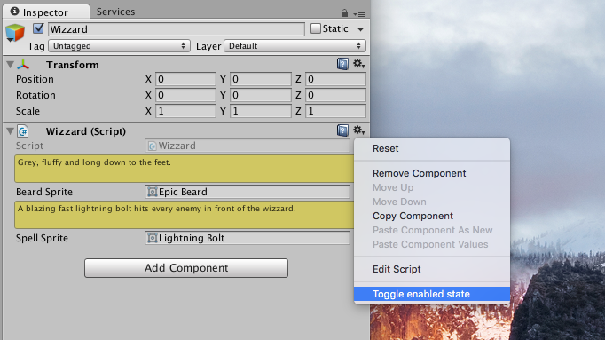

# Component Context Menu

You can put your own functionallity in the context menu of components inspector. This menu is either reachable by a right click on an empty space in an components inspector area or by clicking on the gear icon in the upper right.



```csharp
using UnityEngine;

public class MyBehaviour: MonoBehaviour
{
	[ContextMenu("Toggle enabled state")]
	public void ToggleEnableState()
	{
		enabled = !enabled;
	}
}
```

This can be usefull if you want to trigger some gameplay events while being in the Unity editor play mode.