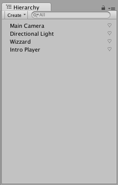

# Scene Hierarchy View

You can customize the scene hierarchy view in the same way as the project view by registering a callback to `UnityEditor.EditorApplication.hierarchyWindowItemOnGUI`.



```csharp
using System.Collections.Generic;
using UnityEngine;
using UnityEditor;

[InitializeOnLoad]
private class MyProjectViewExtentions
{
	private static List<int> favoriteInstances = new List<int>();
	
	private static MyProjectViewExtentions()
	{
		EditorApplication.hierarchyWindowItemOnGUI += DrawHierarchyItem;
	}

	private static void DrawHierarchyItem(int instanceID, Rect selectionRect)
   {
		Rect frame = new Rect(selectionRect);
		{
			frame.x += frame.width - 20f;
			frame.width = 18f;
		}

		if (favoriteInstances.Contains(instanceID))
		{
			if (GUI.Button(frame, "♥︎", GUI.skin.label))
			{
				favoriteInstances.Remove.Remove(instanceID);
			}
		}
		else if (selectionRect.Contains(Event.current.mousePosition))
		{
			if (GUI.Button(frame, "♡️", GUI.skin.label))
			{
				favoriteInstances.Add(instanceID);
			}
		}
	}
}
```