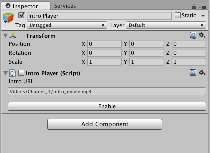

# Inspector

We can change the appeareance of a `MonoBehaviour` or a `ScriptableObject` in the inspector by implementing our own `Editor` for a given type.



Lets say we have the following simple behaviour.

```csharp
using UnityEngine;

public class IntroPlayer: MonoBehaviour
{
    [SerializeField] private string introURL;

    void Start()
    {
        // Play the intro
    }
}
```
We can make a custom editor that could for example give us a button to enable or disable the intro movie, as well as making the text input field larger to make editing longer paths more comfortable.

```csharp
using UnityEngine;
using UnityEditor;

[CustomEditor(typeof(IntroPlayer))]
public class IntroPlayerEditor: Editor
{
    public override void OnInspectorGUI()
    {
        serializedObject.Update();
        var property = serializedObject.FindProperty("introURL");
        EditorGUILayout.LabelField("Intro URL");
        property.stringValue = EditorGUILayout.TextField(property.stringValue, EditorStyles.helpBox);
        serializedObject.ApplyModifiedProperties();

        EditorGUILayout.Space();

        var introPlayer = target as IntroPlayer;
        var buttonText = introPlayer.enabled ? "Disable" : "Enable";
        if (GUILayout.Button(buttonText))
        {
            introPlayer.enabled = !introPlayer.enabled;
        }
    }
}
```
Put inspector extentions in a `Editor` folder to avoid problems when building.

If you only want to add additional UI widgets to the default inspector, you can draw the default UI by calling `base.OnInspectorGUI()`.

```csharp
using UnityEngine;
using UnityEditor;

[CustomEditor(typeof(IntroPlayer))]
public class IntroPlayerEditor: Editor
{
	public override void OnInspectorGUI()
	{
		base.OnIspectorGUI();
	
		var intro = target as IntroPlayer;
		var buttonText = introPlayer.enabled ? "Disable" : "Enable";
		if (GUILayout.Button(buttonText))
		{
			intro.enabled = !intro.enabled;
		}
				
		
	}
}
```