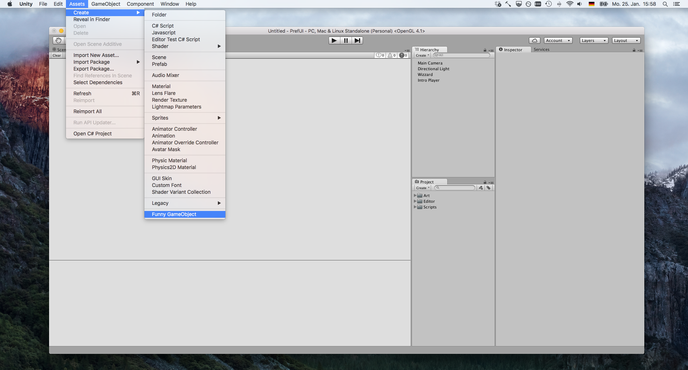

# Menu Bar

You can put your own entries in the unity menu bar. Some paths have special meaning though, like the `Assets/Create/` path, where items in that path are also displayed in the `Create` section of the hierarchy view context menu.



```csharp
using UnityEngine;
using UnityEditor;

public static class MyMenuFunctionality
{
	[MenuItem("Assets/Create/Funny GameObject")]
	private static void CreateFunnyGameObject()
	{
		var gameObject = new GameObject("I'm fun.");
        gameObject.transform.position = Vector3.zero;
	}
}
```