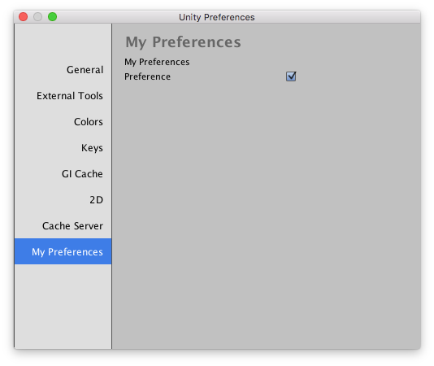

# Preferences

You can add your own settings tab in the unity preferences dialog. This is the right place to store settings for your custom Unity editor extentions.



```csharp
using UnityEngine;
using UnityEditor;

public static class MyPreferences
{
	[PreferenceItem("My Preferences")]
	private static void OnPreferencesGUI()
	{
		GUILayout.Label("My Preferences");

		var preference = EditorPrefs.GetBool("MyPreferecesPreference", defaultValue: false);
		preference = EditorGUILayout.Toggle(label: "Preference", value: preference);
		EditorPrefs.SetBool("MyPreferecesPreference", preference);
	}
}

```

Appart from using `EditorPrefs` you can also store your custom settings in an asset with an `ScriptableObject`. Keep in mind that the settings you edit inside an preference UI should only be for editor tools, like for example when you make a custom build extention for unity that lets you do special stuff when building a game. The advantage of using `EditorPrefs` is that your settings will be shared will all projects for your editor. Like all the other settings in the preference window.

You should not put gameplay specific things in a preference UI.