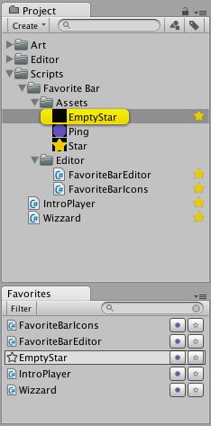

# Project View

You can display custom widgets in the Unity project view by adding a callback to the `UnityEditor.EditorApplication.projectWindowItemOnGUI` event.



To look at how to create your own custom windows as pictured below the project view see the chapter about custom windows.

```csharp
using UnityEngine;
using UnityEditor;

[InitializeOnLoad]
private class MyProjectViewExtentions
{
	private static MyProjectViewExtentions()
	{
		EditorApplication.projectWindowItemOnGUI += DrawProjectItem;
	}

	private static void DrawProjectItem(string guid, Rect selectionRect)
	{
		// Your GUI code here.
	}
}
```
The callback function has the signature `void Method(string guid, Rect selectionRect)` and is called for each item in the project view.

The following is a larger example, showing the implementation of the favorites pictured above (Sans the "star" assets).

```csharp
using System.Collections.Generic;
using UnityEngine;
using UnityEditor;
using System.Linq;
using System;

[InitializeOnLoad]
public class FavoriteBarIcons
{
    public static string emptyStar = "X";
    public static string star = "*";
    public static string ping = "•";
    public static List<string> favoritedGUIDs = new List<string>();

    static FavoriteBarIcons()
    {
        var data = PlayerPrefs.GetString("favbar-data", defaultValue: "");
        var GUIDs = data.Split(',').Where(element => element.Length > 0);
        favoritedGUIDs.Clear();
        favoritedGUIDs.AddRange(GUIDs);

        EditorApplication.projectWindowItemOnGUI += DrawProjectItem;
    }

    private static void DrawProjectItem(string guid, Rect selectionRect)
    {
        var frame = new Rect(selectionRect);
        frame.x += frame.width - 20f;
        frame.width = 18f;

        if (favoritedGUIDs.Contains(guid))
        {
            if (GUI.Button(frame, star, GUI.skin.label))
            {
                RemoveFavorite(guid);
            }
        }
        else if (selectionRect.Contains(Event.current.mousePosition))
        {
            if (GUI.Button(frame, emptyStar, GUI.skin.label))
            {
                AddFavorite(guid);
            }
        }
    }

    public static void AddFavorite(string GUID)
    {
        favoritedGUIDs.Add(GUID);
        var data = string.Join(",", favoritedGUIDs.ToArray());
        PlayerPrefs.SetString("favbar-data", data);
        PlayerPrefs.Save();

        if (FavoriteBarEditor.IsOpen)
        {
            var window = EditorWindow.GetWindow<FavoriteBarEditor>(title: "Favorites", focus: false);
            window.Repaint();
        }
    }

    public static void RemoveFavorite(string GUID)
    {
        favoritedGUIDs.Remove(GUID);
        var data = string.Join(",", favoritedGUIDs.ToArray());
        PlayerPrefs.SetString("favbar-data", data);
        PlayerPrefs.Save();

        if (FavoriteBarEditor.IsOpen)
        {
            var window = EditorWindow.GetWindow<FavoriteBarEditor>(title: "Favorites", focus: false);
            window.Repaint();
        }
        EditorApplication.RepaintProjectWindow();
    }
}
```