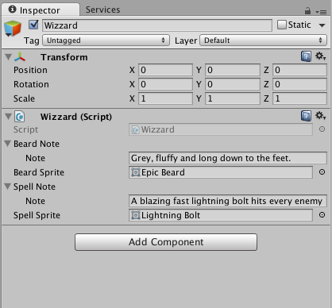
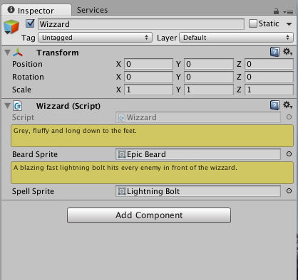

# Property Drawer

Instead of creating a custom editor for a `MonoBehavior` or a `ScriptableObject` that replace the default UI completely, you can create a custom editor for a specific type and only fields of that type will use your custom UI, the remaining inspector will still be the default one.




Lets say we have a custom type that replresents a description for an item

```csharp
[System.Serializable]
public class Note
{
    [SerializeField] private string note;
}
```

We would use such a type like so

```csharp
public class Wizzard: MonoBehaviour
{
    [SerializeField] private Note beardNote;
    [SerializeField] private Sprite beardSprite;
    [SerializeField] private Note spellNote;
    [SerializeField] private Sprite spellSprite;
}
```
```csharp
public class Gunslinger: MonoBehaviour
{
    [SerializeField] private Note hatNote;
    [SerializeField] private Sprite hatSprite;
    [SerializeField] private Note revolverNote;
    [SerializeField] private Sprite revolverSprite;
}
```

If we want to let the the `Note` stand out a bit every time it is seen in the inspector without creating custom editors for each an every `MonoBehaviour` or `ScriptableObject` that uses it, we can use `PropertyDrawers`.

```csharp
using UnityEngine;
using UnityEditor;

[CustomPropertyDrawer(typeof(Note))]
public class NotePropertyDrawer: PropertyDrawer
{
   public override float GetPropertyHeight(SerializedProperty property,
                                           GUIContent label)
   {
       return EditorGUIUtility.singleLineHeight * 2f;
   }

   public override void OnGUI(Rect position,
                              SerializedProperty property,
                              GUIContent label)
   {
       EditorGUI.BeginChangeCheck();

       var originalColor = GUI.color;
       GUI.color = Color.yellow;

       var noteProperty = property.FindPropertyRelative("note");

       var helpBoxStyle = new GUIStyle(EditorStyles.helpBox);

       var newNoteText = EditorGUI.TextField(position,
                                             noteProperty.stringValue,
                                             style: helpBoxStyle);

       GUI.color = originalColor;

       if (EditorGUI.EndChangeCheck())
       {
           noteProperty.stringValue = newNoteText;
       }
   }
}
```

Custom property drawers should be placed inside an `Editor` folder.