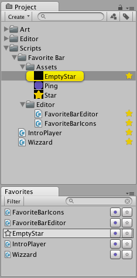

# Windows

Put editor window scripts in a folder called `Editor` to avoid build issues

## Dockable Windows

```csharp
using UnityEngine;
using UnityEditor;

public class MyEditorWindow: EditorWindow
{
	void OnGUI()
	{
		// Your GUI code
	}
}
```

Opening a custom window can be done with `EditorWindow.GetWindow`

```csharp
using UnityEngine;
using UnityEditor;

public static class WindowOpener
{
	[MenuItem("Window/MyWindow")]
	private static void Open()
	{
		var window = EditorWindow.GetWindow<MyEditorWindow>();
		window.Show();
	}
}
```

Of course you can also put the afore mentioned `Open` method inside your custom `EditorWindow` class.

The following is an comprehensive example building on top of the favorites example from the custom project view chapter.

```csharp
using System.Collections.Generic;
using UnityEngine;
using UnityEditor;
using System;

public class FavoriteBarEditor: EditorWindow
{
    private string searchString = "";
    private string filter;

    public static bool IsOpen
    {
        get;
        private set;
    }

    List<string> Types(List<string> GUIDs)
    {
        List<string> types = new List<string>();
        foreach (var GUID in GUIDs)
        {
            var path = AssetDatabase.GUIDToAssetPath(GUID);
            var elementObject = AssetDatabase.LoadAssetAtPath<UnityEngine.Object>(path);
            var typeName = elementObject.GetType().Name;

            if (!types.Contains(typeName))
            {
                types.Add(typeName);
            }
        }

        return types;
    }

    void HandleMenuFunction(object userData)
    {
        filter = (string)userData;
    }

    void OnGUI()
    {
        GUILayout.BeginHorizontal(EditorStyles.toolbar);

        var typeNames = Types(FavoriteBarIcons.favoritedGUIDs);
        if (GUILayout.Button("Filter", GUI.skin.FindStyle("ToolbarButton")))
        {
            var menu = new GenericMenu();
            menu.AddItem(new GUIContent("All"),
                         on: string.IsNullOrEmpty(filter),
                         func: HandleMenuFunction,
                         userData: null);
            menu.AddSeparator(string.Empty);
            foreach (var name in typeNames)
            {
                menu.AddItem(new GUIContent(name),
                             on: name == filter,
                             func: HandleMenuFunction,
                             userData: name);
            }
            menu.ShowAsContext();
        }

        GUILayout.FlexibleSpace();
        searchString = GUILayout.TextField(searchString,
                                           GUI.skin.FindStyle("ToolbarSeachTextField"),
                                           GUILayout.MinWidth(100f));
        if (GUILayout.Button("", GUI.skin.FindStyle("ToolbarSeachCancelButton")))
        {
            searchString = "";
            GUI.FocusControl(null);
        }

        GUILayout.EndHorizontal();

        var deletionElements = new List<string>();

        foreach (var element in FavoriteBarIcons.favoritedGUIDs)
        {
            var path = AssetDatabase.GUIDToAssetPath(element);
            var elementObject = AssetDatabase.LoadAssetAtPath<UnityEngine.Object>(path);

            if ((!elementObject.name.ToLowerInvariant().Contains(searchString.ToLowerInvariant())
                && !string.IsNullOrEmpty(searchString))
                ||
                (!string.IsNullOrEmpty(filter)
                && elementObject.GetType().Name != filter))
            {
                continue;
            }

            var content = EditorGUIUtility.ObjectContent(elementObject,
                                                         elementObject.GetType());

            var bounds = GUILayoutUtility.GetRect(content,
                                                  GUI.skin.label,
                                                  GUILayout.MaxHeight(16f));
            var buttonFrame = new Rect(bounds);
            buttonFrame.width -= 40f;

            if (Selection.activeObject == elementObject)
            {
                GUI.Box(bounds, "", GUI.skin.box);
            }

            if (GUI.Button(buttonFrame, content, GUI.skin.label))
            {
                Selection.activeObject = elementObject;
                EditorGUIUtility.PingObject(elementObject);
            }

            var starRect = new Rect(bounds);
            starRect.x += starRect.width - 20f;
            starRect.width = 18f;

            if (GUI.Button(starRect, FavoriteBarIcons.emptyStar))
            {
                deletionElements.Add(element);
            }

            var pingRect = new Rect(bounds);
            pingRect.x += pingRect.width - 40f;
            pingRect.width = 18f;

            if (GUI.Button(pingRect, FavoriteBarIcons.ping))
            {
                EditorGUIUtility.PingObject(elementObject);
            }
        }

        foreach (var element in deletionElements)
        {
            FavoriteBarIcons.RemoveFavorite(element);
        }
    }

    void OnSelectionChange()
    {
        if (FavoriteBarEditor.IsOpen)
        {
            var window = EditorWindow.GetWindow<FavoriteBarEditor>(title: "Favorites", focus: false);
            window.Repaint();
        }
    }

    [MenuItem("Window/Favorites")]
    static public void ShowWindow()
    {
        var window = EditorWindow.GetWindow<FavoriteBarEditor>(title: "Favorites");
        window.Show();
    }

    void OnEnable()
    {
        IsOpen = true;
    }

    void OnDisable()
    {
       IsOpen = false;
    }
}
```



## Window styles

There are different styles that you can your windows as. The default style, shown above, is a resizable window that can be dragged arount and docked into the Unity editor like the inspetor or scene view.

The different styles can be choosen replacing `window.Show()` from the above example with one of the follwing:

- `Show()` --- Dockable window.
- `ShowAsDropDown(Rect buttonRect, Vector2 windowSize)` --- Window will be displayed next to a specified area (like a button). Like the browser that opens when you click "Add Component" in the inspector.
- `ShowAuxWindow()`
- `ShowPopup()` --- A window without frame, can't be resized or dragged.
- `ShowUtility()` --- Resizable, dragable window. Not dockable. Invisible when not in foreground. Like the color picker.